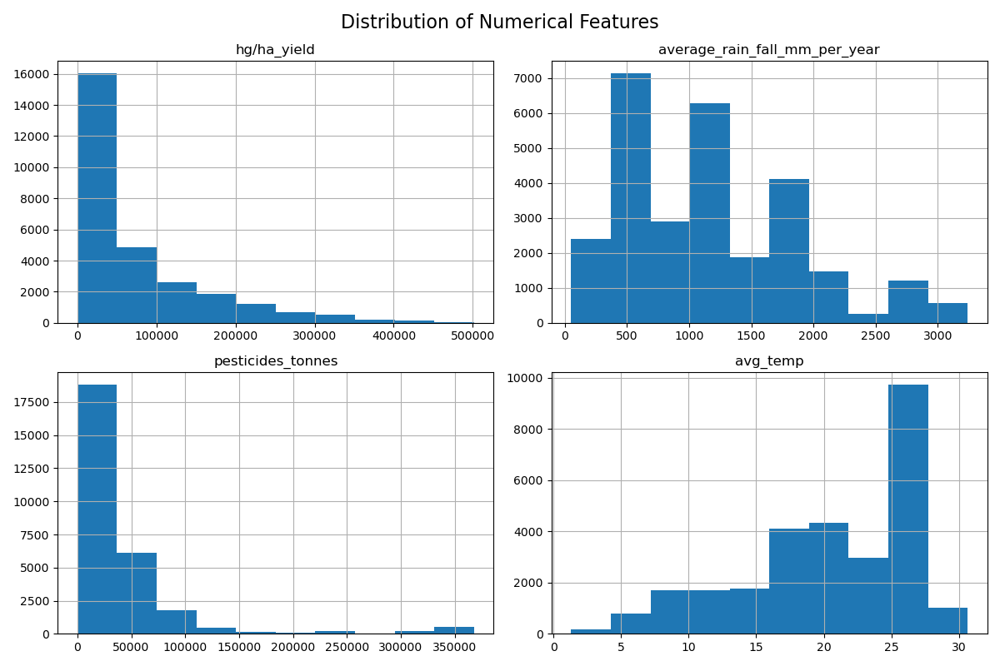
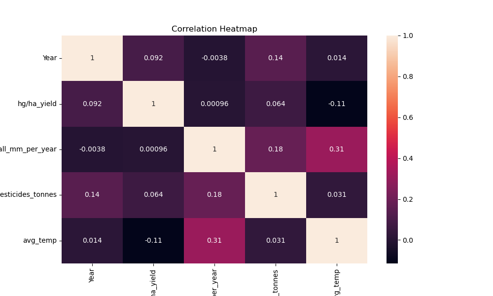

# 🌾 Crop Yield Prediction 🚜

[](https://www.python.org/)
[](https://scikit-learn.org/)
[](https://opensource.org/licenses/MIT)

The project explores multiple regression algorithms to find the most accurate model for predicting yield (measured in `hg/ha`).

## 📊 Dataset Description
The dataset contains historical data including:
- **Area**: The country/region of cultivation.
- **Item**: The type of crop (e.g., Maize, Potatoes, Rice, Wheat, etc.).
- **Year**: The year of observation.
- **average_rain_fall_mm_per_year**: Annual rainfall in millimeters.
- **pesticides_tonnes**: Amount of pesticides used in tonnes.
- **avg_temp**: Average annual temperature.
- **hg/ha_yield**: The target variable representing crop yield in hectograms per hectare.

## 🛠️ Technologies Used
- **Python**: Core programming language.
- **Pandas & NumPy**: Data manipulation and numerical computations.
- **Matplotlib & Seaborn**: Data visualization and exploratory data analysis.
- **Scikit-Learn**: Machine learning library for preprocessing and model building.
- **Jupyter Notebook**: For interactive development and documentation.

## 🚀 Key Features
- **Exploratory Data Analysis (EDA)**: Visualizing feature distributions and correlations.
- **Data Preprocessing**: 
  - Handling missing values and duplicates.
  - One-hot encoding for categorical variables (`Item`).
  - Feature scaling using `StandardScaler`.
- **Machine Learning Models**:
  - **Linear Regression**: Baseline model for continuous prediction.
  - **K-Nearest Neighbors (KNN)**: Non-parametric regression.
  - **Random Forest Regressor**: Ensemble learning for high accuracy.
- **Real-time Prediction**: Interactive script to predict yield based on user-provided inputs.

## 📈 Model Performance
| Model | R² Score | MAE | RMSE |
|-------|----------|-----|------|
| Linear Regression | ~0.75 | 0.41 | 0.55 |
| KNN Regressor | ~0.94 | 0.14 | 0.26 |
| **Random Forest** | **~0.98** | **0.07** | **0.16** |

*Note: Random Forest outperformed other models, capturing complex relationships in the data effectively.*

## 💻 How to Run
1. **Clone the repository**:
   ```bash
   git clone <repository-url>
   cd yield_prediction_main
   ```
2. **Install dependencies**:
   ```bash
   pip install -r requirements.txt
   ```
3. **Run the Notebook**:
   Open `yield.ipynb` in Jupyter Notebook or VS Code to see the full analysis and training process.
4. **Predict Yield**:
   - Run the prediction cell at the end of the notebook.
   - Alternatively, run the standalone script:
     ```bash
     python predict.py
     ```

## 🐳 Docker Deployment
You can run this project as a containerized application:

1. **Build the Docker image**:
   ```bash
   docker build -t yield-prediction-api .
   ```
2. **Run the container**:
   ```bash
   docker run -p 5000:5000 yield-prediction-api
   ```
The API will be available at `http://localhost:5000`.

## 📂 Project Structure
The project follows a modular, production-standard structure:
- `server/`: Main application package.
  - `__init__.py`: App factory.
  - `config.py`: Environment configurations.
  - `routes.py`: API endpoint definitions.
  - `services/`: Business logic and ML services.
- `app.py`: Application entry point.
- `Dockerfile`: Containerization settings.

## 🌐 API Documentation
### `GET /`
Welcome message and endpoint overview.

### `POST /api/v1/predict`
Submit data as JSON to get a prediction.

**Request Body:**
```json
{
  "Year": 2021,
  "average_rain_fall_mm_per_year": 2300,
  "pesticides_tonnes": 4500,
  "avg_temp": 23,
  "Item": "Maize"
}
```

**Response:**
```json
{
  "status": "success",
  "data": {
    "predicted_yield": 10.534,
    "unit": "hg/ha"
  }
}
```

### `GET /api/v1/health`
Check if the server is healthy.

## 🔮 Future Enhancements
- Integration with a web interface (Flask/Streamlit).
- Adding more features like soil quality and humidity.
- Implementing deep learning models for even higher precision.
- Expanding the dataset to more recent years.

---

## 🌟 Overview
This project leverages historical data to provide insights and predictions for various crops. It aims to help farmers and stakeholders make data-driven decisions for better food security.

## 🚀 Key Features
- **Data-Driven Predictions**: Uses Random Forest Regressor for high accuracy.
- **Interactive Notebook**: Step-by-step EDA and Model Training in `yield.ipynb`.
- **Web App**: A Flask-based interface for real-time predictions.
- **Comprehensive Visuals**: Feature distribution and correlation analysis included.

## 📂 Project Structure
```bash
├── app.py              # Flask Application entry point
├── predict.py          # CLI Prediction script
├── setup.bat           # Windows Setup Script
├── assets/             # Project visualizations and images
├── data/               # Datasets (yield_df.csv)
├── models/             # Trained ML models
├── scripts/            # Automation scripts
├── src/                # Modular source code
├── server/             # Web server modules
└── requirements.txt    # Project dependencies
```

## 🛠️ Quick Start

### 1. Setup Environment
Run the automated setup script to create a virtual environment and install dependencies:
```powershell
.\setup.bat
```

### 2. Train the Model
Instead of running a manual notebook, use the automated training pipeline to process data and save the model to the `models/` directory:
```bash
python scripts/train_pipeline.py
```

### 3. Run the Web Application
Launch the interactive prediction interface:
```bash
python app.py
```
Visit `http://localhost:5000` in your browser to see the results!

## 📊 Visualizations
| Feature Distribution | Correlation Heatmap |
| :---: | :---: |
|  |  |

## 🤝 Contributing
Contributions are welcome! See [CONTRIBUTING.md](CONTRIBUTING.md) for details.

## 📄 License
This project is licensed under the MIT License - see the [LICENSE](LICENSE) file for details.

---
Built with ❤️ for a greener future.
